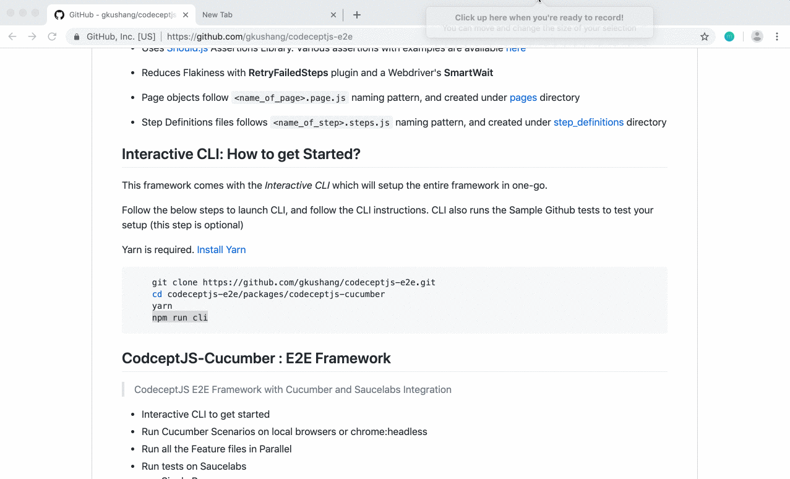

# CodeceptJS E2E

***[CodeceptJS](https://codecept.io/) E2E Framework with Cucumber and Saucelabs cloud***

[](https://codeclimate.com/github/gkushang/codeceptjs-e2e/maintainability) [](https://lerna.js.org/)

[](https://postimg.cc/PpVnY2Jd)
 
> This framework contains Gherkin BDD Tests with CodeceptJS & uses Should.JS assertion library. Intgrated with Saucelabs to run on Multibrowsers in Parallel

* **Why BDD?** Read my Medium post [here](https://medium.com/hackernoon/bdd-in-3-minutes-c3f8fc022237)

* Run All feature files in **Parallel**

* Run All feature files on **Multi-Browsers - run them all in Parallel**

* Scenarios are written in **Cucumber Ghernkin BDD Syntax**, a.k.a `.feature` files. [Prefer writing Declartive Test Scenarios](https://wiki.saucelabs.com/display/DOCS/Best+Practice%3A+Imperative+v.+Declarative+Testing+Scenarios)

* Run on **SauceLabs**. Single browser or Multibrowsers in Parallel

* Uses [Should.js](https://shouldjs.github.io/) Assertions Library. Various assertions with examples are available [here](https://github.com/gkushang/codeceptjs-e2e/blob/master/packages/codeceptjs-cucumber/acceptance/step_definitions/search/github.steps.js)

* Reduces Flakiness with **RetryFailedSteps** plugin and a Webdriver's **SmartWait**

* Page objects follow `<name_of_page>.page.js` naming pattern, and created under [pages](https://github.com/gkushang/codeceptjs-e2e/tree/master/packages/codeceptjs-cucumber/acceptance/pages/) directory

* Step Definitions files follows `<name_of_step>.steps.js` naming pattern, and created under [step_definitions](https://github.com/gkushang/codeceptjs-e2e/tree/master/packages/codeceptjs-cucumber/acceptance/step_definitions) directory


## Interactive CLI: How to get Started? 

This framework comes with the *Interactive CLI* which will setup the entire framework in one-go.

Follow the below steps to launch CLI, and follow the CLI instructions. CLI also runs the Sample Github tests to test your setup (this step is optional)

Yarn is required. [Install Yarn](https://yarnpkg.com/en/docs/install#mac-stable)

```bash

    git clone https://github.com/gkushang/codeceptjs-e2e.git
    cd codeceptjs-e2e/packages/codeceptjs-cucumber
    yarn
    npm run cli
```



## CodceptJS-Cucumber : E2E Framework

> CodeceptJS E2E Framework with Cucumber and Saucelabs Integration

* Interactive CLI to get started
* Run Cucumber Scenarios on local browsers or chrome:headless
* Run all the Feature files in Parallel
* Run tests on Saucelabs
  * Single Browser
  * Multi Browsers. Runs all the Feature files in Parallel on Multibrowsers
* Launch HTML report


To get started, follow the instructions on [codeceptjs-cucumber](https://github.com/gkushang/codeceptjs-e2e/blob/master/packages/codeceptjs-cucumber/README.md)


## CodeceptJS-Saucelabs : Single or Multibrowsers in Parallel

> CodeceptJs Integration with Saucelabs. Ease of Configuration!

* Easy to run tests on Saucelabs with command 

```bash
  yarn acceptance --profile sauce:chrome
```

* Easy to run tests on Multibrowsers / Cross-Browsers. All tests in Parallel with command 

```bash
  yarn acceptance:multibrowsers --profile sauce:chrome,ie,safari
```

To get started, follow the instructions on [codeceptjs-saucelabs](https://github.com/gkushang/codeceptjs-e2e/tree/master/packages/codeceptjs-saucelabs)


## CodeceptJS-Shared : Shared Master Configurations and Helpers

> Shared Master Configurations & Helpers

To get started, follow the instructions on [codeceptjs-shared](https://github.com/gkushang/codeceptjs-e2e/tree/master/packages/codeceptjs-shared)

