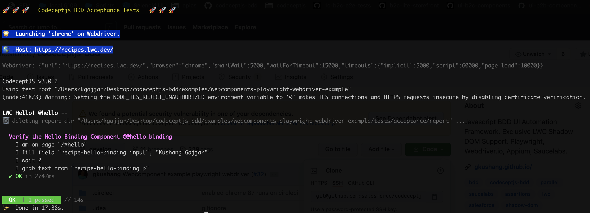

# Webcomponents Playwright & Webdriver E2E Example

This repository demonstrate the Simplified Locator strategy to locate the Shadow Elements to automate app with Webdriver & Playwright.

### 🌀 Clone & Install

```
git clone git@github.com:salesforce/codeceptjs-bdd.git
cd codeceptjs-bdd/examples/webcomponents-playwright-webdriver-example
yarn
```

### 🚀 Run

##### Playwright

HEADLESS mode ON

```
yarn acceptance --profile playwright:chrome
yarn acceptance --profile playwright:firefox
yarn acceptance --profile playwright:safari
```

HEADLESS mode OFF

```
HEADLESS=false yarn acceptance --profile playwright:chrome
```

##### Webdriver

```
yarn acceptance --profile webdriver:chrome
```



## Applitools

Applitools is integrated thru the helper defined [here](https://codecept.io/visual/#using-applitools). In order to enabled Applitools for this example repo, provide the applitools key thru env variable as shown below, or add the KEY to your `codecept.dev.env` file,

```
APPLITOOLS_API_KEY=<your-key>
APPLITOOLS_SERVER_URL=<your-enterprise-server-url> // if your Applitools is enterprise server

```

#### Example Test Run

Uncomment the line `(I as any).eyeCheck('helloBinding')` in `hello-binding.spec.ts` file

##### Run on WebDriver

```
```

Please note: at this time the helper is only supported for Webdriver. Playwright will be enabled soon!
